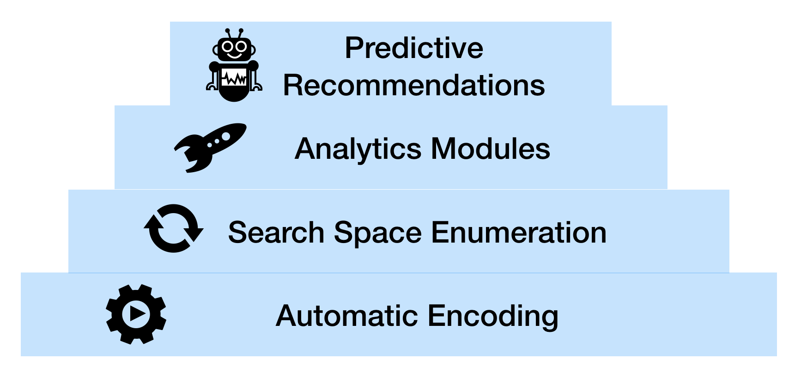
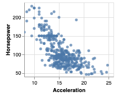
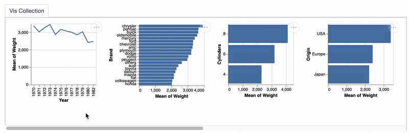
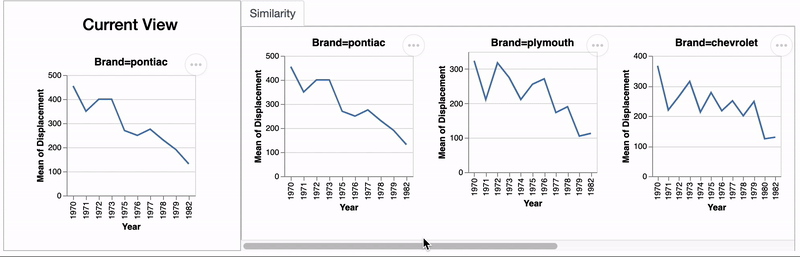

# lux
[](https://travis-ci.org/lux-org/lux)

Lux is a Python library that makes data science easier by automating certain aspects of the data exploration process. Lux is designed to facillitate faster experimentation with data, even when the user doesn't have a clear idea of what they're looking for.

## Features



Lux provides a suite of capabilities as outlined in the hierarchy from the most basic (automatic encoding) to most complex (predictive recommendations).


### Automatic Encoding: 
Lux is built on the principle that users should always be able to visualize anything they specify, without having to think about *how* the visualization should look like. Lux automatically determines the mark and channel mappings based on a set of [best practices](http://hosteddocs.ittoolbox.com/fourshowmeautomaticpresentations.pdf) from [Tableau](https://www.tableau.com). The visualizations are rendered via [Altair](https://github.com/altair-viz/altair/tree/master/altair) into [Vega-Lite](https://github.com/vega/vega-lite) specifications.

    
    import lux
    # Load a dataset into Lux
    dataset = lux.Dataset("data/car.csv")

    dobj = lux.DataObj(dataset,[lux.Column("Acceleration"),
                                lux.Column("Horsepower")])
    


### Search Space Enumeration: 

Lux implements a set of enumeration logic that generates a visualization collection based on a partially specified query. Users can provide a list or a wildcard to iterate over combinations of filter or attribute values and quickly browse through large numbers of visualizations. The partial specification is inspired by existing work on query languages for visualization languages, including [ZQL](https://github.com/vega/compassql) and [CompassQL](https://github.com/vega/compassql).

Here, we want to look at how the attributes `Weight` and `Displacement` depend on all other dimension variables.

```
dobj = lux.DataObj(dataset,[lux.Column(["Weight","Displacement"]),lux.Column("?",dataModel="dimension")])
```



### Analytics Modules: 

Lux comes with a set of analytics capabilities. We can compose  For example, we can ask which car brands have a time series of Displacement simliar to that of Pontiac cars. 

    query = lux.DataObj(dataset,[lux.Column("Year",channel="x"),
                            lux.Column("Displacement",channel="y"),
                            lux.Row("Brand","pontiac")])

    dobj = lux.DataObj(dataset,[lux.Column("Year",channel="x"),
                                lux.Column("Displacement",channel="y"),
                                lux.Row("Brand","?")])

    result = dobj.similarPattern(query,topK=5)



### Predictive Recommendation: 


# Installation

To install lux: 
