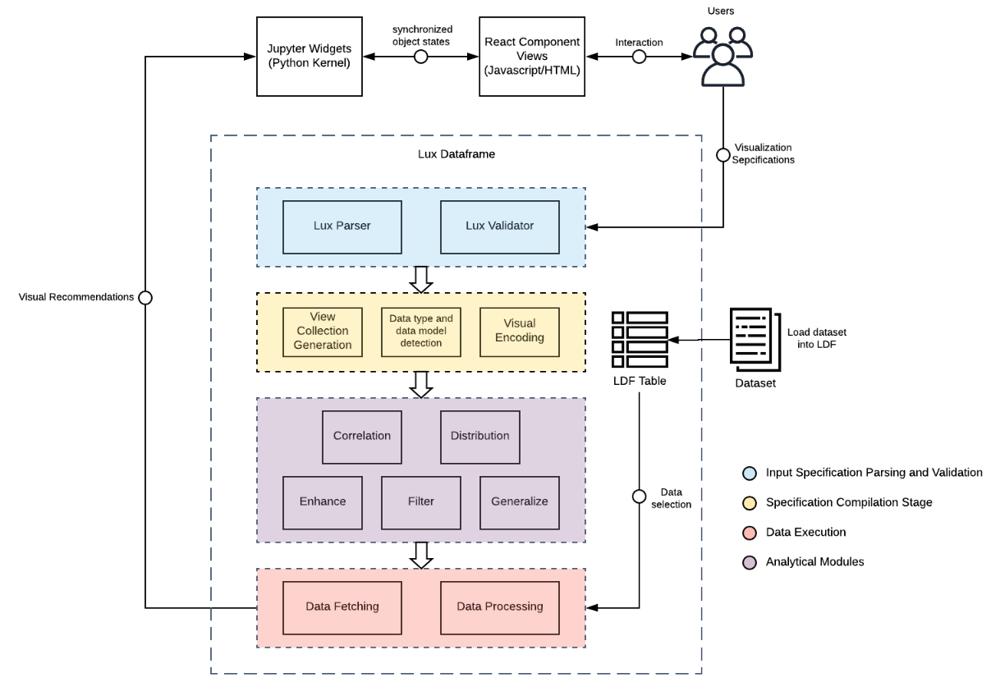

********************************
System Architecture
********************************

Overview of Lux Architecture
=================================
Lux is composed of multiple modules, each with distinct responsibilities. The
architecture can be described in layers: the user interface layer, the user input validation
and parsing layer, the intent processing layer, the data execution layer, and finally the
analytics layer. The system design is intended to be extensibile so that alternative modules can be swapped in at the different layers (e.g., different visualization rendering library or data processing engine).

Lux Data Structures
=================================
In this section, we introduce the essential basic building blocks of Lux that the user interacts with to provide background information before going over the systems internal.

Lux Dataframe
---------------
Lux is designed with a focus on a tight integration with Pandas. 
We define the central piece to Lux's data model as the Lux Dataframe (LDF), a subclassed Pandas dataframe that supports all dataframe operations while also hosting other variables and functions for generating visual recommendations.

Intent
------
Intent is a central concept in Lux, representing the context of what the user is interested in at the current point in their analysis. In Lux, the intent is composed as a list of Clauses. An intent can be attached to a dataframe to indicate the parts of the dataframe that the user is interested in, Lux automatically updates the recommended visualizations based on the user's intent. Intent can also be used be to generate a single visualization, a list of visualizations.

Clause
------
The Clause object represents a single unit of user specification. These specifications can be
attributes that designate columns or values that specify one or more rows in the dataset. Additional fields such as channels, binning, aggregation can also be enforced in the Clause.

Vis/VisList
-------------
A Vis is a programmatic object representing a visualization in Lux. Vis objects can be automatically created through recommendations or specified by users via intent. When a Vis is specified by the user, the user provides the intent (specification of what the Vis is about) and a dataframe to operate on.
VisList is a list of Vis objects, which can also be user-specified or generated via recommendations.
The Lux DataFrame (:code:recommendation property) stores each tab of the recommendations as a VisList, which 
represents a set of visualizations to display to the user. 

Lux System
===========
We overview Lux with a focus on each part of the system architecture. The following sections describe the life cycle of 
how Lux interprets the user's analytical intent, fetches the relevant data, and performs
analytics to generate visualizations.

Parser
-------
The Parser allows users to specify the intent they are interested in exploring in a highly accessible string format, without having to fullly-specify the details of the Clause. Lux interprets the user inputs to transform strings into Clauses for the intent, via a set of syntax rules.

Validator
-----------
After parsing the user input, the Validator flags inconsistencies between user-specified Clauses and the content in the dataset. If the user's input contains a typo or mistake that does not align with the data present in the dataframe, the Validator can warn the data scientists early on in their exploration and suggest corrections. For example, if there is a filter specification where the attribute "Origin" is
equal to "USA", the validation stage checks whether the value "USA" exists for the attribute
"Origin" in the dataset.

Compiler
----------
Lux takes in minimal input specifications from the user and automatically infers the necessary information required for visual analysis. 
As a result, intent specified in Lux often require additional processing before they are used for generate visualizations.
Underspecified information for Clauses within the intent are inferred by the Compiler. The transformation of these Clauses into visualizations (i.e. Vis/VisList) is a three-step process.

1. **VisList generation**: The system generates list of Views for visualization. These Views are created from Clauses in the Context that are fully or partially specified. In the full specification case, there is no ambiguity in which attributes the user wants to visualize. For partially-specified instances, the system locates any Clause objects that include wildcard characters that are denoted by a question mark. These wildcard Clauses are further processed to enumerate all candidate Views that hold explicit Clauses. Ultimately, Lux creates a list of Views that correspond to each visualization that will be displayed in the frontend.
2. **Infer data type and data model information**: The system automatically fills in missing details for each Vis. Each Vis holds Clauses that correspond to the attributes for a visualization. For each of the attributes, we populate the Clauses with corresponding data type and data model information. These bits of information are necessary for encoding data into the correct visual elements.
3. **Visual Encoding**: The final step in the compilation is an automatic encoding process that determines visualization mappings. The system automatically infers type, marks, channels and additional details that can be left underspecified in the input specifications. The system implements a set of visualization encoding rules that automatically determines marks and channels of each visualization based on data properties determined in step 2, as shown in the table below. 

========================== ========================== ========================== 
Number of Dimensions       Number of Measures         Mark Type
========================== ========================== ========================== 
0                          1                          Histogram
1 (ordinal)                0, 1                       Line Chart
1 (categorical)            0, 1                       Bar Chart
2 (ordinal)                0, 1                       Line Chart
2 (categorical)            0, 1                       Line Chart
0                          2                          Scatter plot
1                          2                          Scatter plot
0                          3                          Scatter plot
========================== ========================== ========================== 

Executor
----------
The data executor populates each Vis with a subset of the dataframe based on the specified intent. 
You can learn more about executors in Lux `here <https://lux-api.readthedocs.io/en/latest/source/advanced/executor.html>`_.