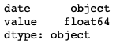
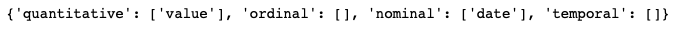
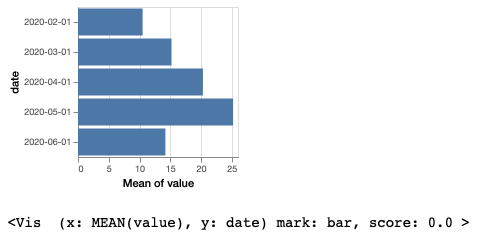
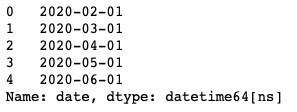
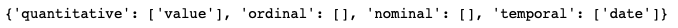
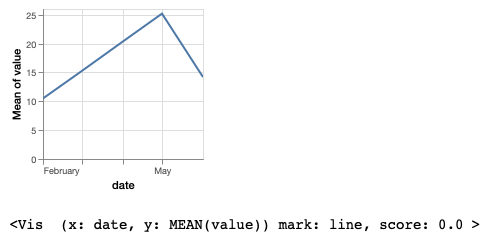
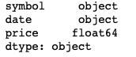
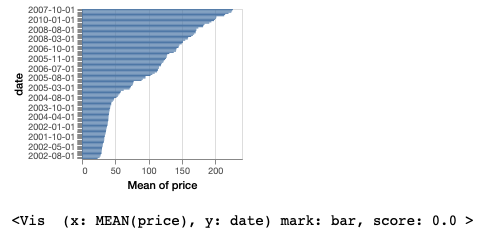
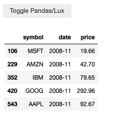
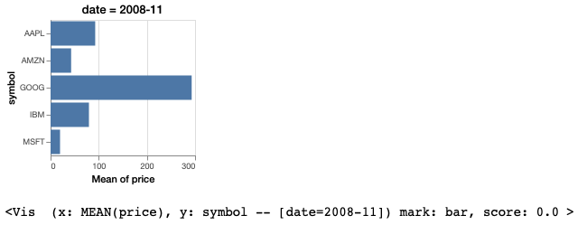

***************************************
Working with Temporal Datetime Columns 
***************************************

.. note:: You can follow along this tutorial in a Jupyter notebook. [`Github <https://github.com/lux-org/lux-binder/blob/master/tutorial/tutorial/5-datetime.ipynb>`_] [`Binder <https://mybinder.org/v2/gh/lux-org/lux-binder/master?urlpath=tree/tutorial/5-datetime.ipynb>`_]

This is a tutorial on how to prepare temporal data for use with Lux. To display temporal fields in Lux, the column must be converted into Pandas's `datetime <https://docs.python.org/3/library/datetime.html>`_ objects. 

Converting Strings to Datetime objects
--------------------------------------

To convert column referencing dates/times into `datetime <https://docs.python.org/3/library/datetime.html>`_ objects, we use `pd.to_datetime <https://pandas.pydata.org/pandas-docs/stable/reference/api/pandas.to_datetime.html>`_ , as follows:

.. code-block:: python
	
	pd.to_datetime(['2020-01-01', '2020-01-15', '2020-02-01'],format="%Y-%m-%d")

As a toy example, a dataframe might contain a `date` attribute as strings of dates:

.. code-block:: python
	
	df = pd.DataFrame({'date': ['2020-02-01', '2020-03-01', '2020-04-01', '2020-05-01','2020-06-01',],
                   'value': [10.5,15.2,20.3,25.2, 14.2]})

By default, the `date` attribute is detected as an `object` type as Pandas's data type `dtype <https://pandas.pydata.org/pandas-docs/stable/reference/api/pandas.DataFrame.dtypes.html>`_ :

.. code-block:: python
	
	df.dtypes

Since `date` is detected as an object type in Pandas, the `date` field is recognized as a `nominal` field in Lux, instead of a `temporal` field:

.. code-block:: python
	
	df.data_type

The typing has implications on the generated visualizations, since nominal chart types are displayed as bar charts, whereas temporal fields are plotted as time series line charts.

.. code-block:: python
	
	vis = Vis(["date","value"],df)
	vis

To fix this, we can convert the `date` column into a datetime object by doing:

.. code-block:: python
	
	df['date'] = pd.to_datetime(df['date'],format="%Y-%m-%d")
	df['date']

After changing the Pandas data type to datetime, we see that date field is recognized as temporal fields in Lux.

.. code-block:: python
	
	df.data_type

.. code-block:: python
	
	vis.refresh_source(df)
	vis

Visualizing Trends across Different Timescales
----------------------------------------------

Lux automatically detects the temporal attribute and plots the visualizations across different timescales to showcase any cyclical patterns. Here, we see that the `Temporal` tab displays the yearly, monthly, and weekly trends for the number of stock records.

.. code-block:: python

  from vega_datasets import data
  df = data.stocks()

  df.recommendation["Temporal"]

.. image:: https://github.com/lux-org/lux-resources/blob/master/doc_img/date-12.png?raw=true
  :width: 600
  :align: center

Advanced Date Manipulation
--------------------------

You might notice earlier that all the dates in our example dataset are the first of the month. In this case, there may be situations where we only want to list the year and month, instead of the full date. Here, we look at how to handle these cases.

Below we look at an example stocks dataset that also has `date` field with each row representing data for the first of each month.

.. code-block:: python
	
	df = pd.read_csv("https://github.com/lux-org/lux-datasets/blob/master/data/stocks.csv?raw=true")

	df.dtypes

.. code-block:: python
	
	vis = Vis(["date","price"],df)
	vis

If we only want Lux to output the month and the year, we can convert the column to a `PeriodIndex <https://pandas.pydata.org/pandas-docs/stable/reference/api/pandas.PeriodIndex.html>`_ using `to_period <https://pandas.pydata.org/pandas-docs/stable/reference/api/pandas.DatetimeIndex.to_period.html>`_ . The `freq` argument specifies the granularity of the output. In this case, we are using 'M' for monthly. You can find more about how to specify time periods `here <https://pandas.pydata.org/pandas-docs/stable/user_guide/timeseries.html#dateoffset-objects>`_ .

.. code-block:: python
	
	df["date"] = pd.DatetimeIndex(df["date"]).to_period(freq='M')

.. code-block:: python
	
	vis.refresh_source(df)
	vis

.. image:: ../img/date-9.png
  :width: 400
  :align: center
  :alt: add screenshot

Specifying Intents With Datetime Fields
---------------------------------------

The string representation seen in the Dataframe can be used to filter out specific dates. 

For example, in the above `stocks` dataset, we converted the date column to a `PeriodIndex`. Now the string representation only shows the granularity we want to see.  We can use that string representation to filter the dataframe in Pandas:

.. code-block:: python
	
	df[df['date'] == '2008-11']

We can also use the same string representation for specifying an intent in Lux.

.. code-block:: python
	
	vis = Vis(["date=2008-11","price","symbol"],df)
	vis

