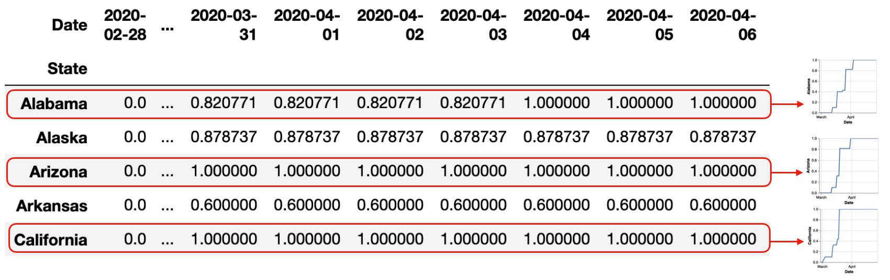
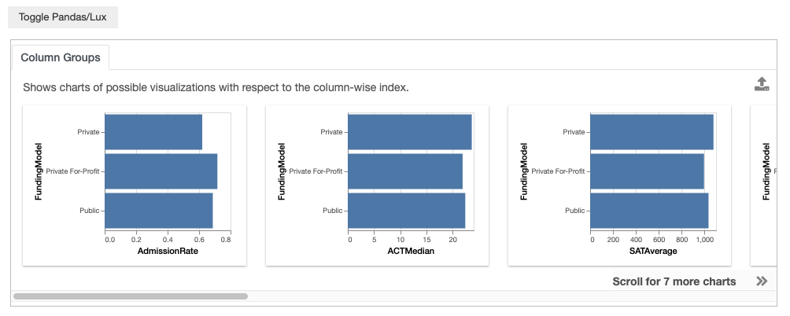
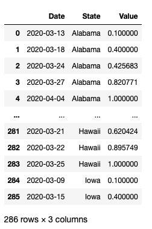
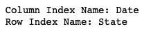
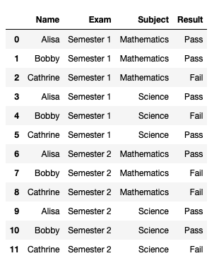
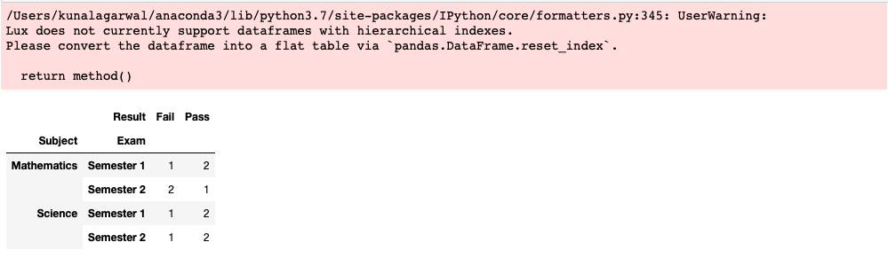

********************************
Visualizing Dataframe Index
********************************

.. note:: You can follow along this tutorial in a Jupyter notebook. [`Github <https://github.com/lux-org/lux-binder/blob/master/tutorial/tutorial/6-index-group.ipynb>`_] [`Binder <https://mybinder.org/v2/gh/lux-org/lux-binder/master?urlpath=tree/tutorial/6-index-group.ipynb>`_]

An index is a convenient way for users to access and manipulate the values of a dataframe. Often, indices are created as part of dataframe operations, such as `groupby`, `pivot`, or `crosstab`.

Lux allows users to visualize dataframe with indices. In pandas, there are two types of indices: 

  1. column index (accessed via `.columns` property of the dataframe), and 
  2. row index (accessed via `.index` property of the dataframe). 
    
A dataframe index can be thought of as an extra row/column that indicates the values that the user is interested in. Lux focuses on visualizing named dataframe indices, i.e., indices with a non-null `name` property, as a proxy of the attribute that the user is interested in or have operated on (e.g., group-by attribute). In particular, dataframes with *named* indices are often pre-aggregated, so Lux visualizes *exactly* the values that the dataframe portrays.

For every *named* row/column indexes in Pandas, Lux displays the corresponding types of actions: 

1. **Column Groups:** shows all possible visualizations generated by groups of column-wise values 
  
.. image:: ../img/columngroup.png
  :width: 600
  :align: center
  :alt: add screenshot

2. **Row Groups:** shows all possible visualizations generated by groups of row-wise values 
  

We will illustrate these two different actions in this tutorial.

Column Group Example: Group-by aggregation
------------------------------------------

In this example, we group by `FundingModel` and compute the average value of the numeric attribute. 

.. code-block:: python
	
	df = pd.read_csv("../../lux/data/college.csv")

The Column Groups action in Lux shows all possible bar chart distributions based on these pre-computed average values.

.. code-block:: python
	
	df.groupby("FundingModel").mean()

Here, since the column index is unnamed, with the columns simply being a subset of the attributes in the original dataframe, Lux does not show the visualization based on each row (Row Group action).

Row Group Example:  Time Series
-------------------------------

There are various common ways to represent time series data via a dataframe. One of the most common ways is a "long" table representation where each observation is stored independently, one for each row, as shown in the example below:

.. code-block:: python
	
	df = pd.read_csv("../../lux/data/state_timeseries.csv")
	df["Date"] = pd.to_datetime(df["Date"])
	df.to_pandas()

To re-arrange this dataframe into time series where each `State` represents a line chart, we perform the `pivot` operation, alongside some interpolation to fill in the missing values. This gives us a "wide" table representation where the column index is each `Date`, and the row index is each `State`.

.. code-block:: python
	
	tseries = df.pivot(index="State",columns="Date",values="Value")
	# Interpolating missing values
	tseries[tseries.columns.min()] = tseries[tseries.columns.min()].fillna(0)
	tseries[tseries.columns.max()] = tseries[tseries.columns.max()].fillna(tseries.max(axis=1))
	tseries = tseries.interpolate('zero',axis=1)

Since both the row and column index is named, Lux displays both Row and Column Group actions.

.. code-block:: python
	
	print ("Column Index Name:", tseries.columns.name)
	print ("Row Index Name:", tseries.index.name)

Lux displays the Row Groups action where each row is plotted as a time series. This allows us to take a look at the time series, from Alabama to Wyoming. Note that in both the Row and Column Groups, we do not perform sorting of the visualizations in order to preserve their one-to-one correspondence with what is displayed in the dataframe.

.. code-block:: python
	
	tseries

.. image:: https://github.com/lux-org/lux-resources/blob/master/doc_img/indexgroup-4.gif?raw=true
  :width: 700
  :align: center
  :alt: show dataframe and briefly show row and column visualizations

Column Group action is less interesting in this case, nevertheless, we can still see that starting from Febrary, Oregon had the leading values compared to other states. As we move towards March and April, California and Florida becomes one of the states with the highest values.

.. image:: https://github.com/lux-org/lux-resources/blob/master/doc_img/indexgroup-5.gif?raw=true
  :width: 700
  :align: center
  :alt: show column group visualizations (specifically California and Florida being at the top)

Complementary Perspectives of Row and Column Groups: Cross-Tabulation of Two Factors
------------------------------------------------------------------------------------

Often, Row and Column Groups can present complementary perspectives on the dataset. This is especially true for dataframes resulting from `pandas.cross-tab <https://pandas.pydata.org/pandas-docs/stable/reference/api/pandas.crosstab.html>`_ .

.. code-block:: python
	
	# Example from http://www.datasciencemadesimple.com/cross-tab-cross-table-python-pandas/
	d = {
	    'Name':['Alisa','Bobby','Cathrine','Alisa','Bobby','Cathrine',
	            'Alisa','Bobby','Cathrine','Alisa','Bobby','Cathrine'],
	    'Exam':['Semester 1','Semester 1','Semester 1','Semester 1','Semester 1','Semester 1',
	            'Semester 2','Semester 2','Semester 2','Semester 2','Semester 2','Semester 2'],
	     
	    'Subject':['Mathematics','Mathematics','Mathematics','Science','Science','Science',
	               'Mathematics','Mathematics','Mathematics','Science','Science','Science'],
	   'Result':['Pass','Pass','Fail','Pass','Fail','Pass','Pass','Fail','Fail','Pass','Pass','Fail']}
	 
	df = pd.DataFrame(d,columns=['Name','Exam','Subject','Result'])
	df.to_pandas()

The cross-tabulation sums up the number of occurrences for a particular outcome. For example, two students failed the exam in Semester 1, and four passed.

The Row Group shows visualizations comparing the Result of Fail/Pass across Semesters. The first visualization indicates that more students passed than failed in Semester 1, whereas in Semester 2, the Fail/Pass rate is equal amongst the students.
The Column Group shows visualizations comparing the exam results from different Semesters across different results. 

.. code-block:: python
	
	result = pd.crosstab([df.Exam],df.Result)
	result

.. image:: https://github.com/lux-org/lux-resources/blob/master/doc_img/indexgroup-7.gif?raw=true
  :width: 700
  :align: center
  :alt: show both column and row group visualizations

.. code-block:: python
	
	result = pd.crosstab([df.Subject],df.Result)
	result

.. image:: https://github.com/lux-org/lux-resources/blob/master/doc_img/indexgroup-8.gif?raw=true
  :width: 700
  :align: center
  :alt: show both column and row group visualizations

Note that Lux does not currently support dataframes with multiple index levels, as a result, it does not support crosstabs with more than 2 factors.

.. code-block:: python
	
	result = pd.crosstab([df.Subject,df.Exam],df.Result)
	result

