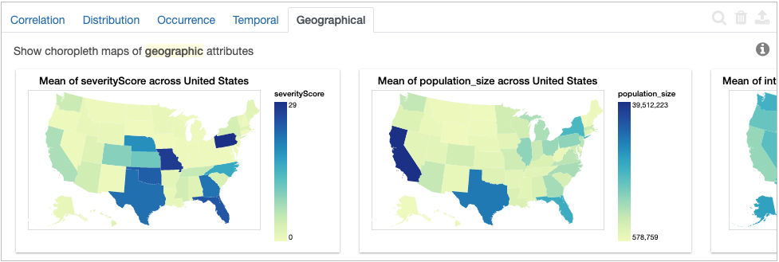
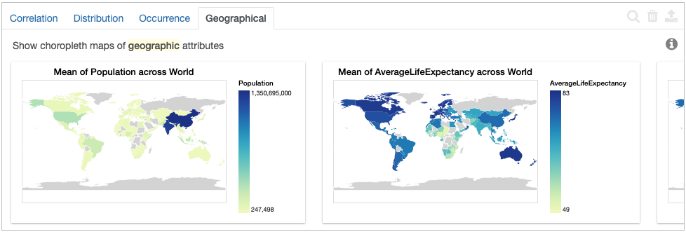

********************************
Working with Geographic Entities
********************************

This is a tutorial on how to automatically plot `choropleths maps <https://en.wikipedia.org/wiki/Choropleth_map.html>`_ in Lux. Lux recognizes select geographic entities, such as US states and countries, then plots them against other columns in a dataset.

Map of US States
--------------------------------------

Below we look at an example COVID-19 dataset that has a "state" field with each row representing data for a state in the US. "state" is a special keyword that allows Lux to classify US states. 

.. code-block:: python
  
  df = pd.read_csv("https://github.com/covidvis/covid19-vis/blob/master/data/interventionFootprintByState.csv?raw=True",index_col=0)
  df

Under the "Geographical" tab on the Lux widget, we immediately see a plethora of choropleths demonstrating how attributes vary by state.

Naming conventions for US states are defined by the `python-us package <https://github.com/unitedstates/python-us/blob/master/us/states.py>`_, which accepts the full state name (e.g. "California"), abbreviation (e.g. "CA"), or FIPS code (e.g. 06) as values for our "state" column.

Map of World Countries
--------------------------

Below we look at the `Happy Planet Index (HPI) <http://happyplanetindex.org/>`_ dataset that has a "country" field with each row representing data for a country in the world. "country" is a special keyword that allows Lux to classify countries. 

.. code-block:: python

  df = pd.read_csv("https://raw.githubusercontent.com/lux-org/lux-datasets/master/data/hpi.csv")
  df

Under the "Geographical" tab on the Lux widget, we immediately see a plethora of choropleths demonstrating how attributes vary by country.

Naming conventions for world countries are defined by the `iso3166 package <https://github.com/deactivated/python-iso3166/blob/master/iso3166/__init__.py>`_, which accepts the full country name (e.g. "Afghanistan"), abbreviations (e.g. "AF" or "AFG"), or ISO code (e.g. 004) as values for our "country" column.