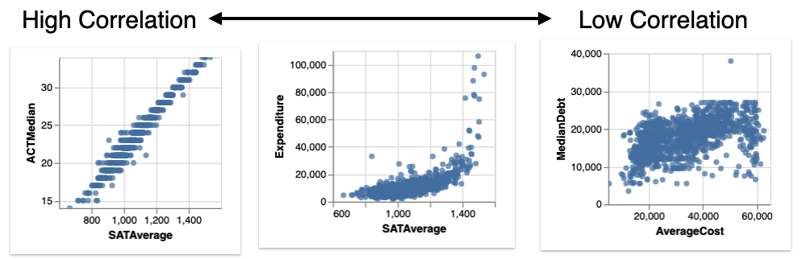
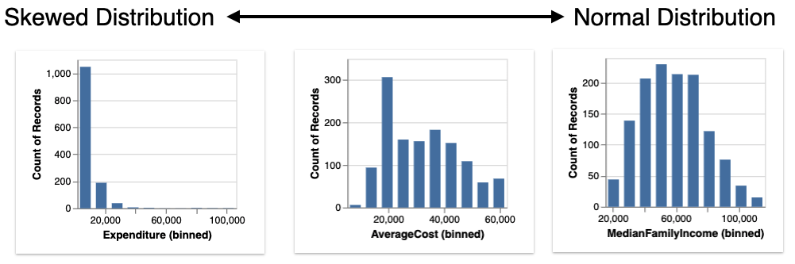
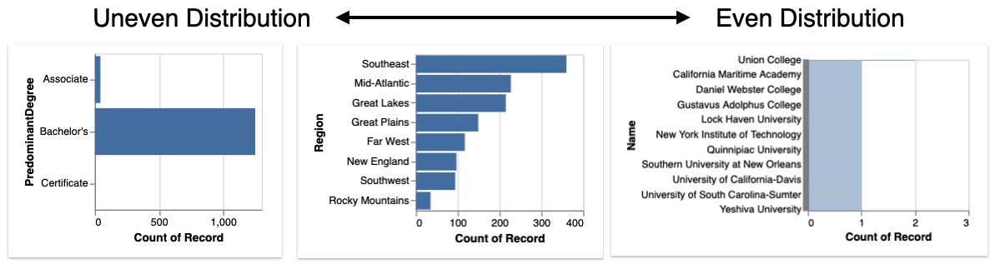

********
Overview
********

.. note:: You can follow along this tutorial in a Jupyter notebook. [`Github <https://github.com/lux-org/lux-binder/blob/master/tutorial/0-overview.ipynb>`_] [`Binder <https://mybinder.org/v2/gh/lux-org/lux-binder/master?urlpath=tree/tutorial/0-overview.ipynb>`_]

This tutorial provides an overview of how you can use Lux in your data exploration workflow. 

Note: This tutorial assumes that you have already installed Lux and the associate Jupyter widget, if you have not done so already, please check out :doc:`this page <../getting_started/installation>`.

Quick Start Example
---------------------

Lux is designed to be tightly integrated with `Pandas <https://pandas.pydata.org/>`_ and can be used as-is, without modifying your existing Pandas code. To enable Lux, simply add `import lux` along with your Pandas import statement.

.. code-block:: python

    import pandas as pd
    import lux

Lux preserves the Pandas dataframe semantics -- which means that you can apply any command from Pandas's API to the dataframes in Lux and expect the same behavior. For example, we can load the dataset via standard Pandas `read_*` commands.

.. code-block:: python

    df = pd.read_csv("lux/data/college.csv")

To visualize your dataframe in Lux, simply print out the dataframe. You should see the default Pandas table display with an additional toggle button.

.. code-block:: python

    df

.. image:: https://github.com/lux-org/lux-resources/blob/master/doc_img/overview-1.gif?raw=true
  :width: 700
  :align: center
  :alt: click on toggle, scroll on Correlation

By clicking on the Toggle button, you can now explore the data visually through Lux. You should see several categories of visualizations recommended to you by browsing through the different tabs. 

.. image:: https://github.com/lux-org/lux-resources/blob/master/doc_img/overview-2.gif?raw=true
  :width: 700
  :align: center
  :alt: click on Distribution and Occurrence tabs

Voila! You have generated your first set of recommendations through Lux! Next, we will describe the details of how these recommendations are generated.

Visualizing Dataframes with `Recommendations`
---------------------------------------------

Recommendations highlight interesting patterns and trends in your dataframe. Lux offers different types of recommendations, known as `analytical actions`. These analytical actions represent different analysis that can be performed on the data. Lux recommends a set of actions depending on the content of your dataframe and your analysis goals and interests (described later). 

As shown in the example above, by default, we display three types of actions shown as different tabs: 

- **Correlation** displays relationships between two quantitative variables, ranked by the most to least correlated scatterplots.

- **Distribution** displays histogram distributions of different quantitative attributes in the dataframe, ranked by the most to least skewed distributions.

- **Occurrence** displays bar chart distributions of different categorical attributes in the dataframe, ranked by the most to least uneven bar charts.

  

Refer to :doc:`this page <../reference/lux.action>` for details on different types of action in Lux.

Expressing Analysis Interest and Goals with User `Intent`
----------------------------------------------------------

We saw an example of how recommendations can be generated for the dataframe without providing additional information.
Beyond these basic recommendations, you can further specify your analysis *intent*, i.e., the data attributes and values that you are interested in visualizing. 

For example, let's say that you are interested in learning more about the median earning of students after they attend the college. You can set your intent in Lux to indicate that you are interested  the attribute `MedianEarning`.

.. code-block:: python

    df.intent = ["MedianEarnings"]

When you print out the dataframe again, you should see three different tabs of visualizations recommended to you. 

.. code-block:: python

    df

.. image:: https://github.com/lux-org/lux-resources/blob/master/doc_img/overview-3.gif?raw=true
  :width: 700
  :align: center
  :alt: scroll through Enhance, click on Filter tab

In the displayed widget, the visualization on the left represent the visualization that you have expressed as your intent. 
On the right, you see the gallery of visualizations recommended based on the specified intent.

You can specify a variety of things that you might be interested in, for example, let's say that you are interested in the the median earnings of students in publicly-funded colleges.

.. code-block:: python

    df.intent = ["MedianEarnings", "FundingModel=Public"]
    df

For more advance use of intent, refer to :doc:`this page <../guide/intent>` on how to specify the intent.

Steering Recommendations via User Intent
----------------------------------------
In the earlier example, when `MedianEarning` is expressed as the intent, the current intent is represented as C = {MedianEarnings}.

.. code-block:: python

    df.intent = ["MedianEarnings"]

Given the updated intent, additional actions (Enhance and Filter) are generated. 

- **Enhance** adds an additional attribute to intended visualization. Enhance lets users compare the effect the added variable on the intended visualization. For example, enhance displays visualizations involving C' = {MedianEarnings, *added attribute*}, including:

    - {MedianEarnings, **Expenditure**}
    - {MedianEarnings, **AverageCost**}
    - {MedianEarnings, **AverageFacultySalary**}.
 
.. image:: https://github.com/lux-org/lux-resources/blob/master/doc_img/overview-4.png?raw=true
  :width: 700
  :align: center
  :alt: screenshot of Enhance

- **Filter** adds an additional filter to the intended visualization. Filter lets users browse through what the intended visualization looks like for different subsets of data. For example, Filter displays visualizations involving C' = {MedianEarnings, *added filter*}, including: 

    - {MedianEarnings, **FundingModel=Public**}
    - {MedianEarnings, **Region=Southeast**}
    - {MedianEarnings, **Region=Great Lakes**}.

.. image:: https://github.com/lux-org/lux-resources/blob/master/doc_img/overview-5.png?raw=true
  :width: 700
  :align: center
  :alt: screenshot of Filter
