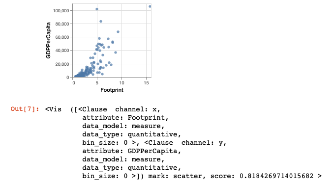
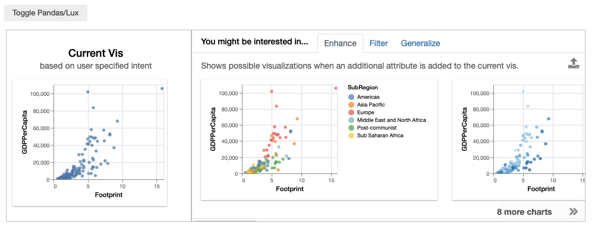
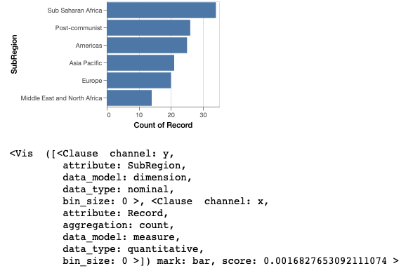
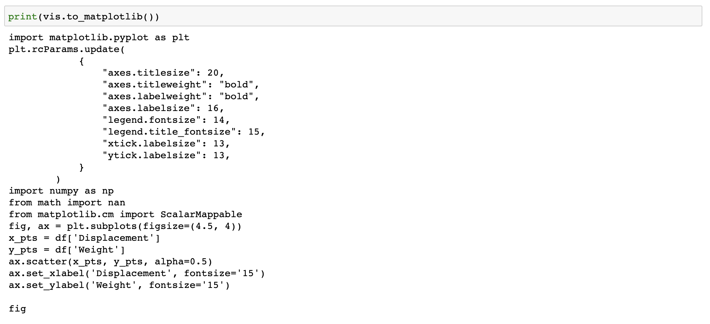
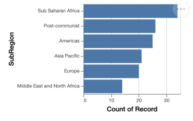
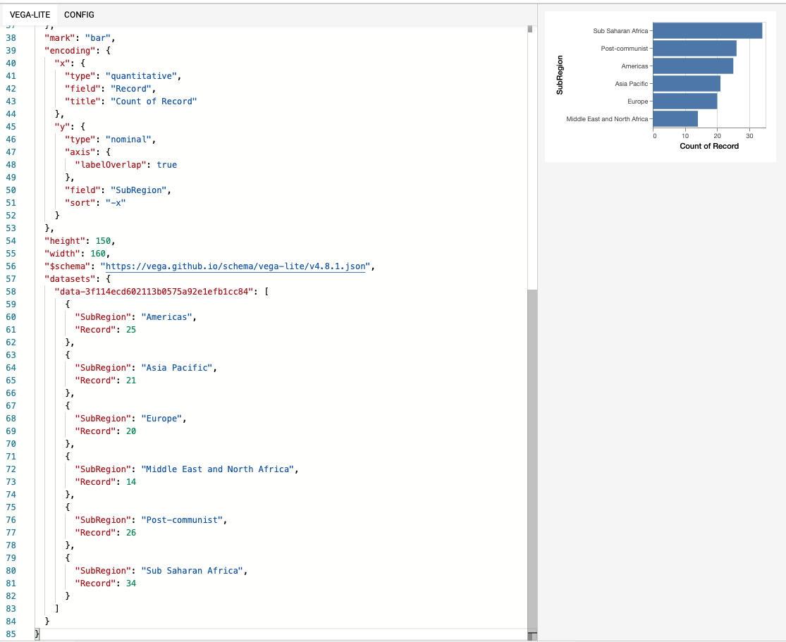
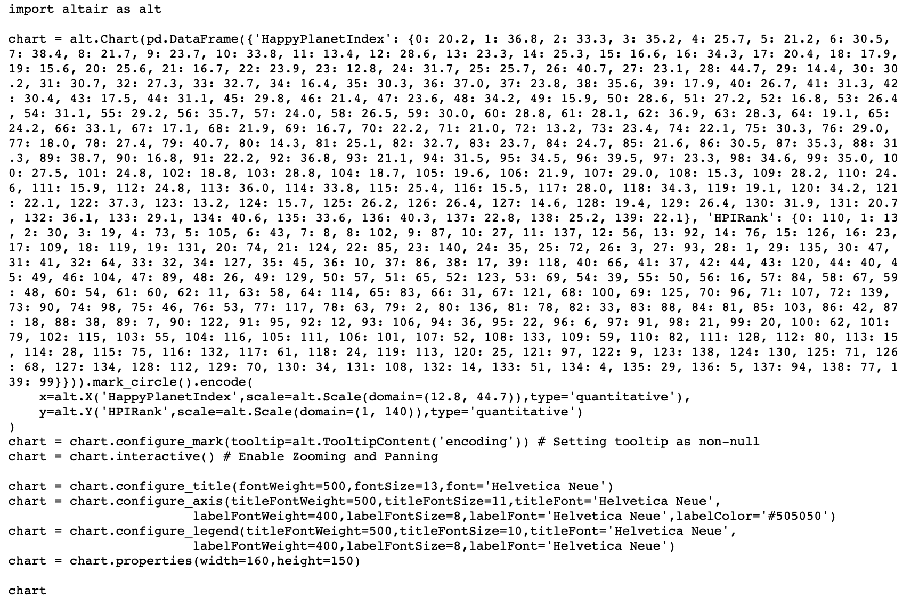
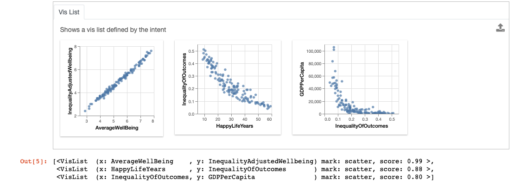
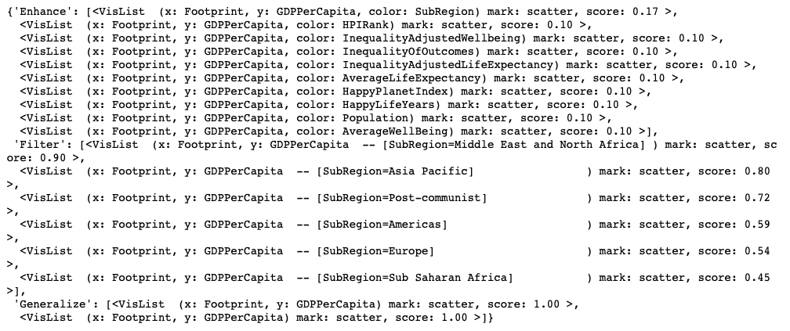
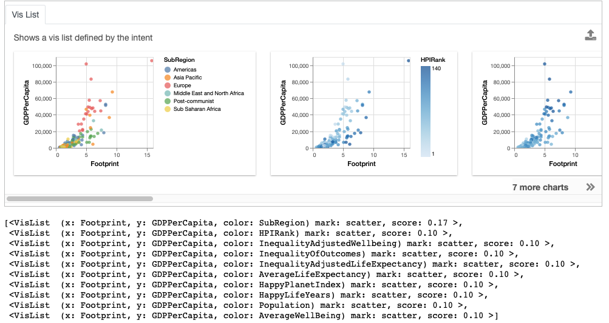

********************************
Exporting Vis From Widget
********************************

.. note:: You can follow along this tutorial in a Jupyter notebook. [`Github <https://github.com/lux-org/lux-binder/blob/master/tutorial/3-widget-vis-export.ipynb>`_] [`Binder <https://mybinder.org/v2/gh/lux-org/lux-binder/master?urlpath=tree/tutorial/3-widget-vis-export.ipynb>`_]

In this tutorial, we will first look at how you can access and export a single visualizations in the widget as code to further work with in the notebook. Then, we walk through how you can export more than one visualizations in the widget as an interactive report for sharing or presentation.

.. code-block:: python

    import pandas as pd
    import lux

.. code-block:: python

    df = pd.read_csv("https://raw.githubusercontent.com/lux-org/lux-datasets/master/data/hpi.csv")
    df.default_display = "lux" # Set Lux as default display

As an example, we load in the `Happy Planet Index <http://happyplanetindex.org/>`_ dataset, which contains metrics related to well-being for 140 countries around the world. Note that for the convienience of this tutorial, we set Lux as the default display so we don't have to Toggle from the Pandas table display everytime we print the dataframe.

Working with a Single Visualizations from Widget
--------------------------------------------------

Selecting a Single Visualization as :code:`Vis`
~~~~~~~~~~~~~~~~~~~~~~~~~~~~~~~~~~~~~~~~~~~~~~~~~~~
From the dataframe recommendations, the visualization showing the relationship between :code:`GDPPerCapita` and :code:`Footprint` is very interesting. In particular, there is an outlier with extremely high ecological footprint as well as high GDP per capita. So we click on this visualization and click on the export button.

.. code-block:: python

    df

.. image:: https://github.com/lux-org/lux-resources/blob/master/doc_img/export-3.gif?raw=true
  :width: 700
  :align: center
  :alt: 1) scroll and find the vis for GDPPerCapita and Footprint 2) select and export this vis

.. code-block:: python

    vis = df.exported[0]
    vis

Setting Vis as the Updated Intent
~~~~~~~~~~~~~~~~~~~~~~~~~~~~~~~~~~~~~~

Often, we might be interested in other visualizations that is related to a visualization of interest and want to learn more. With the exported Vis, we can update the intent associated with dataframe to be based on the selected Vis to get more recommendations related to this visualization.

.. code-block:: python

    df.intent = vis
    df

Exporting Visualizations as Code
~~~~~~~~~~~~~~~~~~~~~~~~~~~~~~~~~~~~~~

.. image:: https://github.com/lux-org/lux-resources/blob/master/doc_img/export-9.gif?raw=true
  :width: 700
  :align: center
  :alt: 1) click on `Occurrence` tab, then 2) hover around the SubRegion v.s. Number of Records chart

Looking at the Occurrence tab, we can select and export the bar chart distribution of :code:`SubRegion`.

.. code-block:: python

    vis = df.exported[0]
    vis

To allow further edits of visualizations, visualizations can be exported to code in `Matplotlib <https://matplotlib.org/>`_, `Altair <https://altair-viz.github.io/>`_, or as `Vega-Lite <https://vega.github.io/vega-lite/>`_ specification via the :code:`to_code` command:

.. code-block:: python

    print (vis.to_code("matplotlib"))
    print (vis.to_code("altair"))
    print (vis.to_code("vegalite"))

Exporting to Matplotlib
==========================
We can also export the visualization as code in `Matplotlib <https://matplotlib.org/>`_.

.. code-block:: python

    print (vis.to_matplotlib())

This code can be copy-and-pasted back into a new notebook cell for further editing.

.. code-block:: python

  import matplotlib.pyplot as plt
  plt.rcParams.update(
              {
                  "axes.titlesize": 20,
                  "axes.titleweight": "bold",
                  "axes.labelweight": "bold",
                  "axes.labelsize": 16,
                  "legend.fontsize": 14,
                  "legend.title_fontsize": 15,
                  "xtick.labelsize": 13,
                  "ytick.labelsize": 13,
              }
          )
  import numpy as np
  from math import nan
  from matplotlib.cm import ScalarMappable
  fig, ax = plt.subplots(figsize=(4.5, 4))
  x_pts = df['Displacement']
  y_pts = df['Weight']
  ax.scatter(x_pts, y_pts, alpha=0.5)
  ax.set_xlabel('Displacement', fontsize='15')
  ax.set_ylabel('Weight', fontsize='15')

  fig

.. image:: ../img/export-17.png
  :width: 700
  :align: center
  :alt: add screenshot

Exporting to Altair
==========================

.. code-block:: python

    print (vis.to_altair())

.. code-block:: python

    import altair as alt
    visData = pd.DataFrame({'SubRegion': {0: 'Americas', 1: 'Asia Pacific', 2: 'Europe', 3: 'Middle East and North Africa', 4: 'Post-communist', 5: 'Sub Saharan Africa'}, 'Record': {0: 25, 1: 21, 2: 20, 3: 14, 4: 26, 5: 34}})

    chart = alt.Chart(visData).mark_bar().encode(
        y = alt.Y('SubRegion', type= 'nominal', axis=alt.Axis(labelOverlap=True), sort ='-x'),
        x = alt.X('Record', type= 'quantitative', title='Count of Record'),
    )
    chart = chart.configure_mark(tooltip=alt.TooltipContent('encoding')) # Setting tooltip as non-null
    chart = chart.configure_title(fontWeight=500,fontSize=13,font='Helvetica Neue')
    chart = chart.configure_axis(titleFontWeight=500,titleFontSize=11,titleFont='Helvetica Neue',
                labelFontWeight=400,labelFontSize=8,labelFont='Helvetica Neue',labelColor='#505050')
    chart = chart.configure_legend(titleFontWeight=500,titleFontSize=10,titleFont='Helvetica Neue',
                labelFontWeight=400,labelFontSize=8,labelFont='Helvetica Neue')
    chart = chart.properties(width=160,height=150)
    chart

Exporting to Vega-Lite
==========================

You can also export this as Vega-Lite specification and view/edit the specification on `Vega Editor <https://vega.github.io/editor>`_.

.. code-block:: python

    print (vis.to_vegalite())

Exporting Standalone Visualization Code
====================================================

Let's say now we are interested in the scatter plot of the :code:`HPIRank` and :code:`HappyPlanetIndex`.

.. code-block:: python

    vis = df.recommendation["Correlation"][0]

Since the dataset used to create the scatterplot is large, Lux infers the variable name used locally for the data, and uses that as the data in the printed code block.

.. code-block:: python

    print (vis.to_altair())

.. image:: ../img/export-14.png
  :width: 700
  :align: center
  :alt: screenshot of code with df

If we wanted to include the actual data in the returned codeblock, we would use :code:`to_altair(standalone=True)` to create a code snippet that contains all the data that we need embedded in the code itself, which can be run outside the notebook.

.. code-block:: python

    print (vis.to_altair(standalone=True))

Working with Multiple Visualizations from Widget
--------------------------------------------------

We have seen how you can select and export a single visualization of interest. Now let's say that we found several visualizations that displays interesting trends to filter to and investigate further.

Selecting Multiple Visualization as :code:`VisList`
~~~~~~~~~~~~~~~~~~~~~~~~~~~~~~~~~~~~~~~~~~~~~~~~~~~

To do this, we can select one or more visualizations of interest and click on the export button to extract the selected visualizations into a separate widget for further processing.

.. image:: https://github.com/lux-org/lux-resources/blob/master/doc_img/export-1.gif?raw=true
  :width: 700
  :align: center
  :alt: 1) scroll through Correlation, then 2) click on any 3 visualization (let's say 2nd, 5th and something towards the end), then 3) click on the export button and make sure the blue message box show up

After clicking on the export button, the selected visualizations are stored inside the :code:`exported` property of the dataframe as a :code:`VisList`, which can be accessed programmatically.

.. code-block:: python

    bookmarked_charts = df.exported
    bookmarked_charts

Accessing Widget Recommendations
~~~~~~~~~~~~~~~~~~~~~~~~~~~~~~~~~~~~

We can access the set of recommendations generated for the dataframes via the dataframe property :code:`recommendation`.

.. code-block:: python

    df.recommendation

The resulting output is a Python dictionary, with the key as the name of the recommendation category and values as a :code:`VisList` of recommendations.

.. code-block:: python

    df.recommendation["Enhance"]

Exporting Entire Dataframe Widgets
-----------------------------------

Let's say that you are interested in export all the visualizations recommended by Lux, you can export the dataframe widget to an interactive HTML report or data application to share with others. By integrating Lux with `DataPane <https://datapane.com/>`_, `Panel <https://panel.holoviz.org/>`_ or `Streamlit <https://streamlit.io/>`_, you can intersperse Markdown text, images, and other rich graphics and widgets, alongside the output widget generated by Lux to compose and author your own data science narrative.

Exporting to HTML Report
~~~~~~~~~~~~~~~~~~~~~~~~~

You can export the visualizations into a static HTML using the following command:

.. code-block:: python

    df.save_as_html()

By default, the file is saved as `export.html`, you can optionally specify the HTML filename in the input parameter.

.. code-block:: python

    df.save_as_html('hpi.html')

If you would like to output HTML be returned directly via :code:`save_as_html`, you can input the parameter :code:`output=True`.

.. code-block:: python

  html_content  = df.save_as_html(output=True)

The HTML export functionality is the basis for exporting to interactive data apps, described next.

Exporting to DataPane
~~~~~~~~~~~~~~~~~~~~~~~~~~~~~~

`DataPane <https://datapane.com/>`_ is a Python library used for creating interactive data science reports. To integrate Lux with a DataPane report, you can wrap the HTML widget output with a `dp.HTML <https://docs.datapane.com/reports/blocks/text-code-and-html#html>`_ block as shown below:

.. code-block:: python

  import pandas as pd
  import datapane as dp
  import lux
  df = pd.read_csv("https://raw.githubusercontent.com/lux-org/lux-datasets/master/data/hpi.csv")
  html_content = df.save_as_html(output=True)
  dp.Report("## Analysis of Happy Planet Index Dataset\n Check out these cool visualizations!",
    dp.HTML(html_content)
  ).save(path='report.html', open=True)

You should find that a webpage :code:`report.html` that pops up automatically.

.. image:: https://github.com/lux-org/lux-resources/blob/master/doc_img/export-datapane.png?raw=true
  :width: 700
  :align: center

Exporting to Panel
~~~~~~~~~~~~~~~~~~~~~~~~~~~~~~

`Panel <https://panel.holoviz.org/>`_ is a powerful Python library for interactive data exploration and data apps. To integrate Lux with Panel, you can wrap the HTML widget output with a `panel.pane.HTML <https://panel.holoviz.org/reference/panes/HTML.html>`_ pane as shown below:

.. code-block:: python

  import html

  import pandas as pd
  import panel as pn
  import lux

  pn.extension(sizing_mode="stretch_width")

  df = pd.read_csv("https://raw.githubusercontent.com/lux-org/lux-datasets/master/data/hpi.csv")

  def save_as_iframe(df, style="width:100%;height:100%", frameborder="0"):
      html_content = df.save_as_html(output=True)
      html_content = html.escape(html_content)
      return f"""<iframe srcdoc="{html_content}" style={style} frameborder="{frameborder}"
  "allowfullscreen></iframe>"""

  lux_iframe_report = save_as_iframe(df)

  # Can display in notebook
  lux_panel = pn.pane.HTML(lux_iframe_report, height=425)

  # Can display as app with panel serve
  pn.template.FastListTemplate(site="💡 Lux and Panel", title="Analysis of Happy Planet Index Dataset", main=[lux_panel]).servable();

After running :code:`panel serve app.ipynb` or :code:`panel serve app.py` in the command line, you should find the Panel app hosted in your browser (e.g., :code:`http://localhost:5006/app`):

.. image:: https://github.com/lux-org/lux-resources/blob/master/doc_img/export-panel.png?raw=true
  :width: 700
  :align: center

Exporting to Streamlit
~~~~~~~~~~~~~~~~~~~~~~~~~~~~~~

`Streamlit <https://streamlit.io/>`_ is a Python library that simplifies the process of creating interactive data apps that can be shared and deployed anywhere.
To integrate Lux with Streamlit, you can wrap the HTML widget output with a `Streamlit Component <https://docs.streamlit.io/en/stable/streamlit_components.html>`_. As shown below, you can create a file called :code:`app.py`:

.. code-block:: python

  import streamlit as st
  import streamlit.components.v1 as components
  from pathlib import Path
  import pandas as pd
  import lux

  def app():
      st.title('Analysis of Happy Planet Index Dataset')
      st.write('Check out these cool visualizations!')
      df = pd.read_csv("https://raw.githubusercontent.com/lux-org/lux-datasets/master/data/hpi.csv")
      export_file = 'visualizations.html'
      html_content = df.save_as_html(output=True)
      components.html(html_content, width=800, height=350)

  app()

After running :code:`streamlit run app.py` in the command line, you should find the Streamlit app hosted in your browser (e.g., :code:`localhost:8501`):

.. image:: https://github.com/lux-org/lux-resources/blob/master/doc_img/export-streamlit.png?raw=true
  :width: 700
  :align: center