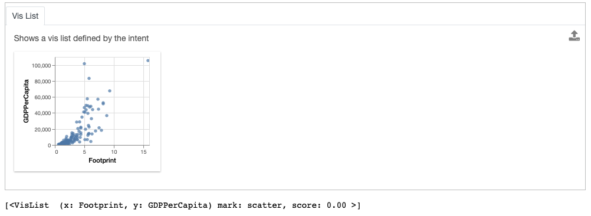
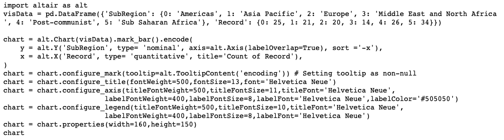

********************************
Exporting Vis From Widget
********************************

.. note:: You can follow along this tutorial in a Jupyter notebook. [`Github <https://github.com/lux-org/lux-binder/blob/master/tutorial/3-widget-vis-export.ipynb>`_] [`Binder <https://mybinder.org/v2/gh/lux-org/lux-binder/master?urlpath=tree/tutorial/3-widget-vis-export.ipynb>`_]

In this tutorial, we look at the `Happy Planet Index <http://happyplanetindex.org/>`_ dataset, which contains metrics related to well-being for 140 countries around the world. We demonstrate how you can select visualizations of interest and export them for further analysis. 

.. code-block:: python

    import pandas as pd
    import lux

.. code-block:: python

    df = pd.read_csv("lux/data/hpi.csv")
    df.default_display = "lux" # Set Lux as default display

Note that for the convienience of this tutorial, we have set Lux as the default display so we don't have to Toggle from the Pandas table display everytime we print the dataframe.

Exporting one or more visualizations from recommendations
~~~~~~~~~~~~~~~~~~~~~~~~~~~~~~~~~~~~~~~~~~~~~~~~~~~~~~~~~~

In Lux, you can click on visualizations of interest and export them into a separate widget for further processing.

.. code-block:: python

    df

.. image:: https://github.com/lux-org/lux-resources/blob/master/doc_img/export-1.gif?raw=true
  :width: 700
  :align: center
  :alt: 1) scroll through Correlation, then 2) click on any 3 visualization (let's say 2nd, 5th and something towards the end), then 3) click on the export button and make sure the blue message box show up

.. code-block:: python

    bookmarked_charts = df.exported
    bookmarked_charts

.. image:: ../img/export-2.png
  :width: 700
  :align: center
  :alt: add screenshot of exported VisList (include the Out[] __repr__ string) in screenshot

From the dataframe recommendations, the visualization showing the relationship between `GDPPerCapita` and `Footprint` is very interesting. In particular, there is an outlier with extremely high ecological footprint as well as high GDP per capita. So we click on this visualization and click on the export button.

.. code-block:: python

    df

.. image:: https://github.com/lux-org/lux-resources/blob/master/doc_img/export-3.gif?raw=true
  :width: 700
  :align: center
  :alt: 1) scroll and find the vis for GDPPerCapita and Footprint 2) select and export this vis

.. code-block:: python

    vis = df.exported[0]
    vis

.. image:: ../img/export-4.png
  :width: 600
  :align: center
  :alt: add screenshot of exported vis

Setting Vis as the Updated Intent
~~~~~~~~~~~~~~~~~~~~~~~~~~~~~~~~~~~~~

Often, we might be interested in other visualizations that is related to a visualization of interest and want to learn more. With the exported Vis, we can update the intent associated with dataframe to be based on the selected Vis to get more recommendations related to this visualization.

.. code-block:: python

    df.intent = vis
    df

.. image:: ../img/export-5.png
  :width: 700
  :align: center
  :alt: add screenshot

Accessing Widget State
~~~~~~~~~~~~~~~~~~~~~~

We can access the set of recommendations generated for the dataframes via the properties `recommendation`.

.. code-block:: python
    
    df.recommendation

.. image:: ../img/export-6.png
  :width: 700
  :align: center
  :alt: add screenshot

The resulting output is a dictionary, keyed by the name of the recommendation category.

.. code-block:: python
    
    df.recommendation["Enhance"]

.. image:: ../img/export-7.png
  :width: 700
  :align: center
  :alt: add screenshot

You can also access the vis represented by the current intent via the property `current_vis`.

.. code-block:: python

    df.current_vis

Exporting Visualizations as Code
~~~~~~~~~~~~~~~~~~~~~~~~~~~~~~~~~~

Let's revist our earlier recommendations by clearing the specified intent.

.. code-block:: python

    df.clear_intent()
    df

.. image:: https://github.com/lux-org/lux-resources/blob/master/doc_img/export-9.gif?raw=true
  :width: 700
  :align: center
  :alt: 1) click on `Occurrence` tab, then 2) hover around the SubRegion v.s. Number of Records chart

Looking at the Occurrence tab, we are interested in the bar chart distribution of country `SubRegion`.

.. code-block:: python

    vis = df.recommendation["Occurrence"][0]
    vis

.. image:: ../img/export-10.png
  :width: 500
  :align: center
  :alt: add screenshot

To allow further edits of visualizations, visualizations can be exported to code in `Altair <https://altair-viz.github.io/>`_ or as `Vega-Lite <https://vega.github.io/vega-lite/>`_ specification.

.. code-block:: python

    print (vis.to_Altair())

This can be copy-and-pasted back into a new notebook cell for further editing.

.. code-block:: python

    import altair as alt
    visData = pd.DataFrame({'SubRegion': {0: 'Americas', 1: 'Asia Pacific', 2: 'Europe', 3: 'Middle East and North Africa', 4: 'Post-communist', 5: 'Sub Saharan Africa'}, 'Record': {0: 25, 1: 21, 2: 20, 3: 14, 4: 26, 5: 34}})

    chart = alt.Chart(visData).mark_bar().encode(
        y = alt.Y('SubRegion', type= 'nominal', axis=alt.Axis(labelOverlap=True), sort ='-x'),
        x = alt.X('Record', type= 'quantitative', title='Count of Record'),
    )
    chart = chart.configure_mark(tooltip=alt.TooltipContent('encoding')) # Setting tooltip as non-null
    chart = chart.configure_title(fontWeight=500,fontSize=13,font='Helvetica Neue')
    chart = chart.configure_axis(titleFontWeight=500,titleFontSize=11,titleFont='Helvetica Neue',
                labelFontWeight=400,labelFontSize=8,labelFont='Helvetica Neue',labelColor='#505050')
    chart = chart.configure_legend(titleFontWeight=500,titleFontSize=10,titleFont='Helvetica Neue',
                labelFontWeight=400,labelFontSize=8,labelFont='Helvetica Neue')
    chart = chart.properties(width=160,height=150)
    chart

.. image:: ../img/export-12.png
  :width: 300
  :align: center
  :alt: add screenshot 

You can also export this as Vega-Lite specification and vis/edit the specification on `Vega Editor <https://vega.github.io/editor>`_.

.. code-block:: python

    print (vis.to_VegaLite())

.. image:: ../img/export-13.png
  :width: 700
  :align: center
  :alt: add screenshot of what this looks like in Vega Editor

Let's say now we are interested in the scatter plot of the `HPIRank` and `HappyPlanetIndex`.

.. code-block:: python

    vis = df.recommendation["Correlation"][0]

Since the dataset used to create the scatterplot is large, Lux infers the variable name used locally for the data, and uses that as the data in the printed code block.

.. code-block:: python

    print (vis.to_Altair())

.. image:: ../img/export-14.png
  :width: 700
  :align: center
  :alt: screenshot of code with df

If we wanted to include the actual data in the returned codeblock, we would use `to_Altair(standalone=True)`

.. code-block:: python

    print (vis.to_Altair(standalone=True))

.. image:: ../img/export-15.png
  :width: 700
  :align: center
  :alt: screenshot of code with embedded data
