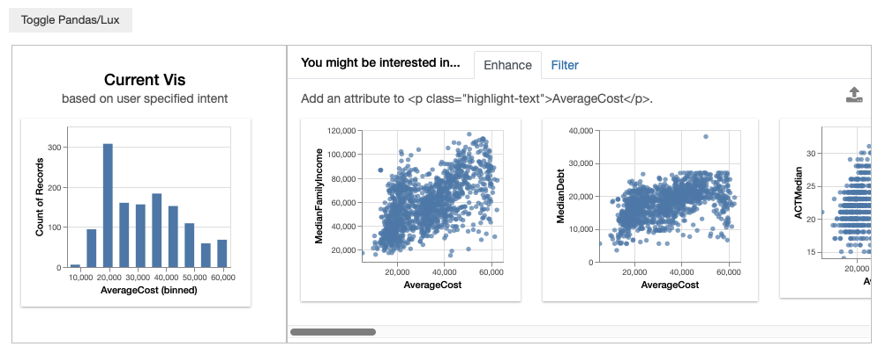
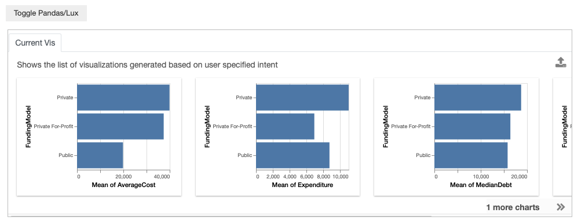
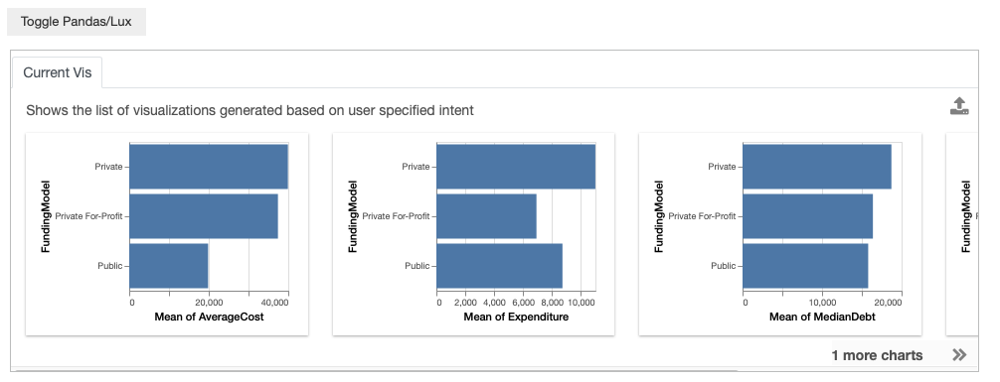
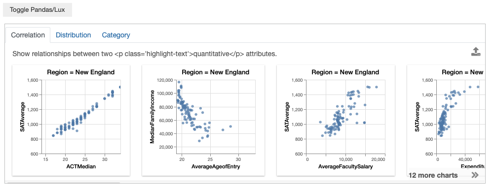
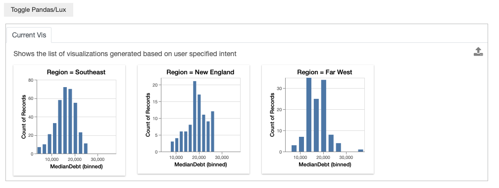
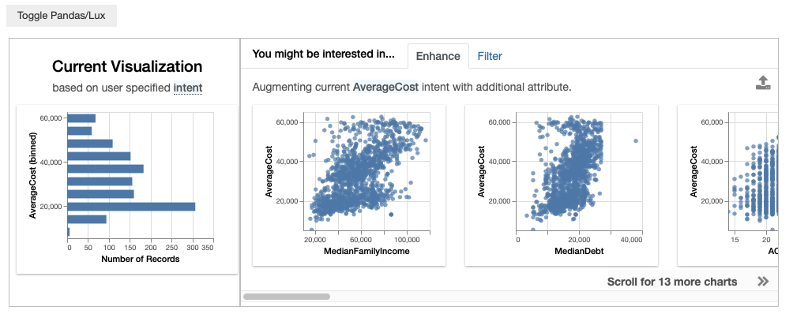
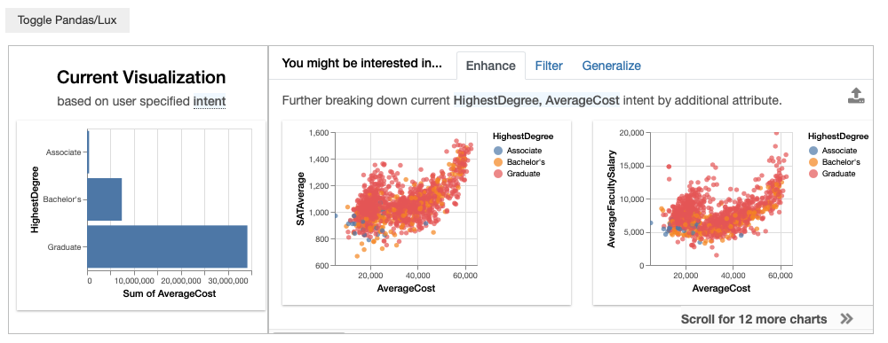
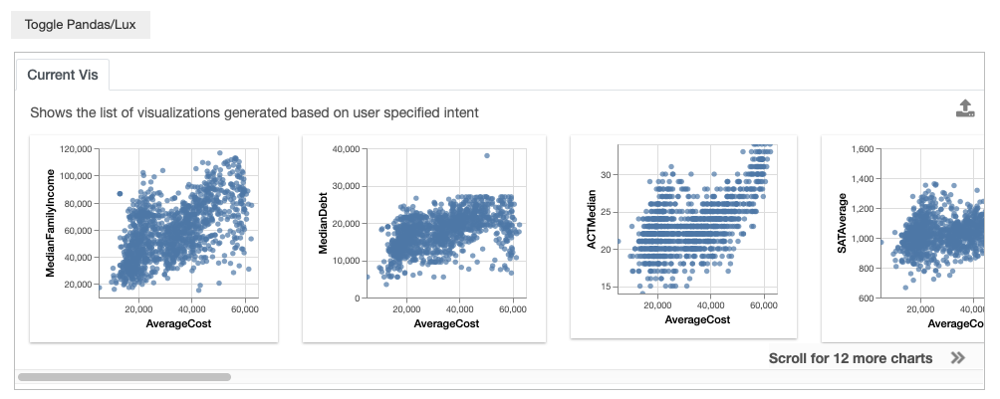
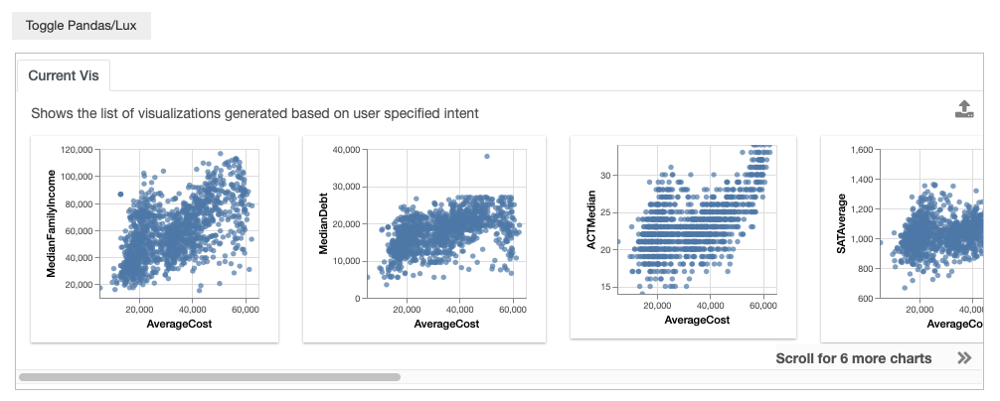
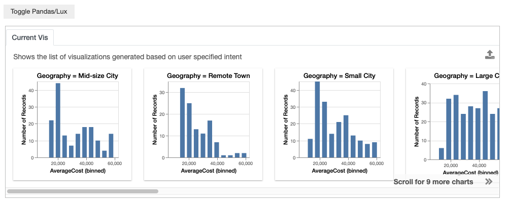

********************************
Specifying Intent in Lux
********************************

.. note:: You can follow along this tutorial in a Jupyter notebook. [`Github <https://github.com/lux-org/lux-binder/blob/master/tutorial/1-specifying-intent.ipynb>`_] [`Binder <https://mybinder.org/v2/gh/lux-org/lux-binder/master?urlpath=tree/tutorial/1-specifying-intent.ipynb>`_]

Lux provides a flexible language for communicating your analysis intent to the system, so that Lux can provide better and more relevant recommendations to you. In this tutorial, we will see different ways of specifying the intent, including the attributes and values that you are interested or not interested in, enumeration specifiers, as well as any constraints on the visualization encoding.

The primary way to set the current intent associated with a dataframe is by setting the `intent` property of the dataframe, and providing a list of specification as input. We will first describe how intent can be specified through convenient shorthand descriptions as string inputs, then we will describe advance usage via the :mod:`lux.Clause <lux.vis.Clause>` object.

Basic descriptions
------------------

Specifying attributes of interest
~~~~~~~~~~~~~~~~~~~~~~~~~~~~~~~~~~

You can indicate that you are interested in an attribute, let's say `AverageCost`.

.. code-block:: python

    df.intent = ['AverageCost']

You might be interested in multiple attributes, for instance you might want to look at both `AverageCost` and `FundingModel`. When multiple clauses are specified, Lux applies all the clauses in the intent and searches for visualizations that are relevant to `AverageCost` **and** `FundingModel`.

.. code-block:: python

    df.intent = ['AverageCost','FundingModel']
    df 

.. image:: ../img/intent-2.png
  :width: 700
  :align: center
  :alt: add screenshot

Let's say that in addition to `AverageCost`, you are interested in the looking at a list of attributes that are related to different financial measures, such as `Expenditure` or `MedianDebt`, and how they breakdown with respect to `FundingModel`. 

You can specify a list of desired attributes separated by the `|` symbol, which indicates an `OR` relationship between the list of attributes. If multiple clauses are specified, Lux automatically create combinations of the specified attributes. 

.. code-block:: python

    possible_attributes = "AverageCost|Expenditure|MedianDebt|MedianEarnings"
    df.intent = [possible_attributes,"FundingModel"]
    df

Alternatively, you could also provide the specification as a list: 

.. code-block:: python

    possible_attributes = ['AverageCost','Expenditure','MedianDebt','MedianEarnings']
    df.intent = [possible_attributes,"FundingModel"]
    df

Specifying values of interest
~~~~~~~~~~~~~~~~~~~~~~~~~~~~~

In Lux, you can also specify particular values corresponding to subsets of the data that you might be interested in. For example, you may be interested in only colleges located in New England. 

.. code-block:: python

    df.intent = ["Region=New England"]
    df

You can also specify multiple values of interest using the same `|` notation that we saw earlier. For example, you might be comparing colleges in New England, Southeast, and Far West.

.. code-block:: python

    df.intent = ["MedianDebt","Region=New England|Southeast|Far West"]

Note that since there are three different visualizations that is generated based on the intent, we only display these possible visualization, rather than the recommendations

.. note::

    You might be wondering what is the difference between specifying values of interest through the intent in Lux versus applying a filter directly on the dataframe through Pandas. By specifying the intent directly via Pandas, Lux is not aware of the specified inputs to Pandas, so these values of interest will not be reflected in the recommendations.

    .. code-block:: python
        
        df[df["Region"]=="New England"]
    
    .. image:: ../img/intent-7.png
      :width: 700
      :align: center
      :alt: add screenshot

    You can specify to Lux that you are interested in learning more about colleges in New England. 

    In the resulting Filter action, we see that Lux suggests visualizations in other `Region` as recommendations.

    .. code-block:: python
        
        df.intent = ["Region=New England"]
        df
        
    .. image:: ../img/intent-8.png
      :width: 700
      :align: center
      :alt: add screenshot

    So while both approaches applies the filter on the specified visualization, the subtle difference between *applying* a filter and *indicating* a filter intent leads to different sets of resulting recommendations. In general, we encourage using Pandas for filtering if you are certain about applying the filter (e.g., a cleaning operation deleting a specific data subset), and specify the intent through Lux if you might want to experiment and change aspects related to the filter in your analysis. 

Advanced intent specification through :mod:`lux.Clause <lux.vis.Clause>`
---------------------------------------------------------------------------

The basic string-based description provides a convenient way of specifying the intent. However, not all specification can be expressed through the string-based descriptions, more complex specification can be expressed through the :mod:`lux.Clause <lux.vis.Clause>` object. The two modes of specification is essentially equivalent, with the :mod:`lux.processor.Parser` parsing the `description` field in the :mod:`lux.Clause <lux.vis.Clause>` object.

Specifying attributes or values of interest
~~~~~~~~~~~~~~~~~~~~~~~~~~~~~~~~~~~~~~~~~~~~

To see an example of how lux.Clause is used, we rewrite our earlier example of expressing interest in `AverageCost` as: 

.. code-block:: python
    
    df.intent = [lux.Clause(attribute='AverageCost')]

Similarly, we can use :mod:`lux.Clause <lux.vis.Clause>` to specify values of interest:

.. code-block:: python 

    df.intent = ['MedianDebt',
                lux.Clause(attribute='Region',filter_op='=', value=['New England','Southeast','Far West'])]

Both the `attribute` and `value` fields can take in either a single string or a list of attributes to specify items of interest. This example also demonstrates how we can intermix the `lux.Clause` specification alongside the basic string-based specification for convenience.

Adding constraints to override auto-inferred details
~~~~~~~~~~~~~~~~~~~~~~~~~~~~~~~~~~~~~~~~~~~~~~~~~~~~~~~~~

So far, we have seen examples of how Lux takes in a loosely specified intent and automatically fills in many of the details that is required to generate the intended visualizations. There are situations where the user may want to override these auto-inferred values. For example, you might be interested in fixing an attribute to show up on a particular axis, ensuring that an aggregated attribute is summed up instead of averaged by default, or picking a specific bin size for a histogram. Additional properties specified on lux.Clause acts as constraints to the specified intent. 

Fixing attributes to specific axis channels
^^^^^^^^^^^^^^^^^^^^^^^^^^^^^^^^^^^^^^^^^^^^^^^^^

As we saw earlier, when we set `AverageCost` as the intent, Lux generates a histogram with `AverageCost` on the x-axis.
While this is unconventional, let's say that instead we want to set `AverageCost` to the y axis. We would specify this as additional properties to constrain the intent clause.
    
.. code-block:: python
    
    df.intent = [lux.Clause(attribute='AverageCost', channel='y')]
    df

Changing aggregation function applied
^^^^^^^^^^^^^^^^^^^^^^^^^^^^^^^^^^^^^^^^^^^^^^^^^

We can also set constraints on the type of aggregation that is used. For example, by default, we use `mean` as the default aggregation function for quantitative attributes.

.. code-block:: python

    df.intent = ["HighestDegree","AverageCost"]
    df

.. image:: ../img/intent-10.png
  :width: 700
  :align: center
  :alt: add screenshot

We can override the aggregation function to be `sum` instead. 

.. code-block:: python

    df.intent = ["HighestDegree",lux.Clause("AverageCost",aggregation="sum")]
    df 

The possible aggregation values are the same as the ones supported in Pandas's `agg <https://pandas.pydata.org/pandas-docs/stable/reference/api/pandas.DataFrame.agg.html>`_ function, which can either be a string shorthand (e.g., "sum", "count", "min", "max", "median") or as a numpy aggregation function.

For example, we can change the aggregation function to be the point-to-point value (`np.ptp <https://numpy.org/doc/stable/reference/generated/numpy.ptp.html>`_) by inputting the numpy function.

.. code-block:: python

    df.intent = ["HighestDegree",lux.Clause("AverageCost",aggregation=np.ptp)]
    df

.. image:: ../img/intent-12.png
  :width: 700
  :align: center
  :alt: add screenshot

Specifying wildcards
~~~~~~~~~~~~~~~~~~~~~

Let's say that you are interested in *any* attribute with respect to `AverageCost`. Lux support *wildcards* (based on `CompassQL <https://idl.cs.washington.edu/papers/compassql/>`_ ), which specifies the enumeration of any possible attribute or values that satisfies the provided constraints.

.. code-block:: python
    
    df.intent = ['AverageCost',lux.Clause('?')]
    df

The space of enumeration can be narrowed based on constraints. For example, you might only be interested in looking at scatterplots of `AverageCost` with respect to quantitative attributes. This narrows the 15 visualizations that we had earlier to only 9 visualizations now, involving only quantitative attributes.

.. code-block:: python
    
    df.intent = ['AverageCost',lux.Clause('?',data_type='quantitative')]
    df

The enumeration specifier can also be placed on the value field. For example, you might be interested in looking at how the distribution of `AverageCost` varies for all possible values of `Geography`.

.. code-block:: python
    
    df.intent = ['AverageCost','Geography=?']

or 

.. code-block:: python

    df.intent = ['AverageCost',lux.Clause(attribute='Geography',filter_op='=',value='?')]
    df

