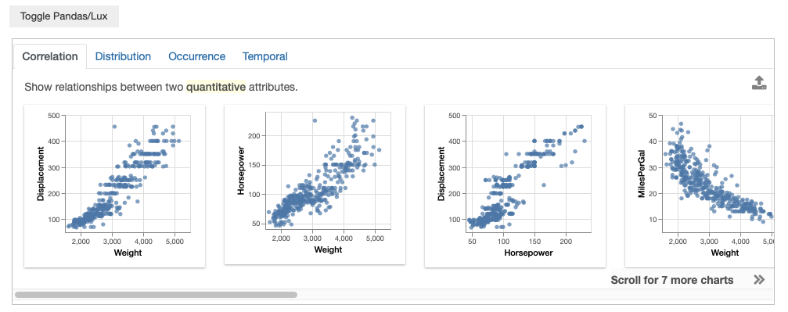
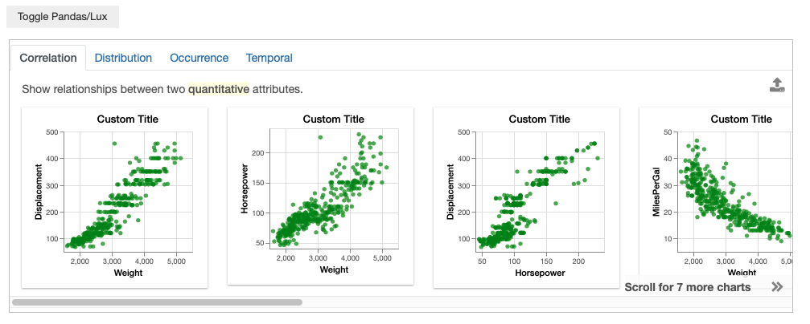
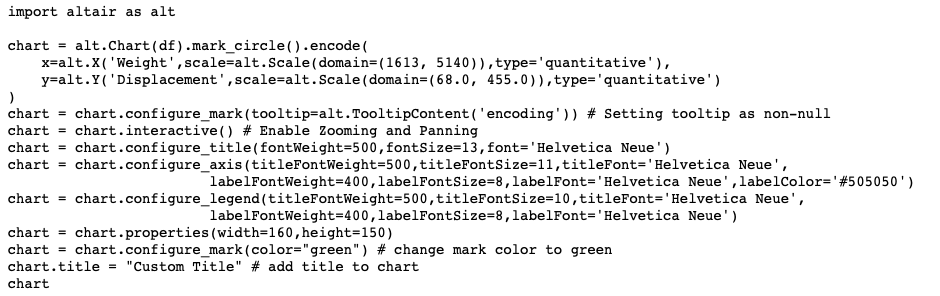
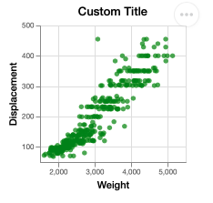
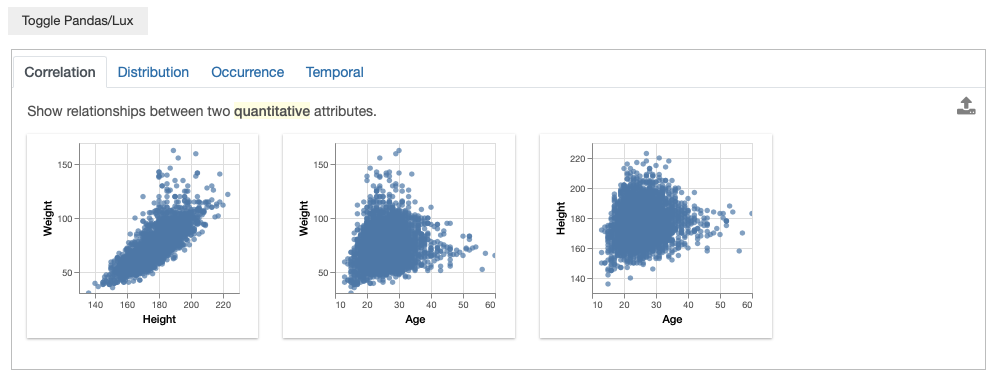
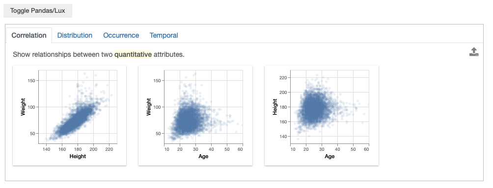

********************************
Styling Custom Plot Settings 
********************************

.. note:: You can follow along this tutorial in a Jupyter notebook. [`Github <https://github.com/lux-org/lux-binder/blob/master/tutorial/4-chart-settings.ipynb>`_] [`Binder <https://mybinder.org/v2/gh/lux-org/lux-binder/master?urlpath=tree/tutorial/4-chart-settings.ipynb>`_]

In the last tutorial, we saw how :code:`Vis` objects could be exported into visualization code for further editing. What if we want to change the chart settings for *all* the visualizations displayed in the widget. In Lux, we can change the chart settings and aesthetics by inputting global custom plot settings the :code:`plot_config`.

Example #1 : Changing Color and Title of all charts
---------------------------------------------------

Here, we've loaded in the `Cars dataset <http://lib.stat.cmu.edu/datasets/>`_ and the visualizations recommended in the widget are in its default settings.

.. code-block:: python
	
	df

By default, visualizations in Lux are rendered using the `Altair <https://altair-viz.github.io/index.html>`_ library.
To change the plot configuration in Altair, we need to specify a function that takes an `AltairChart <https://altair-viz.github.io/user_guide/generated/toplevel/altair.Chart.html?highlight=chart>`_ as input, performs some chart configurations in Altair, and returns the chart object as an output.

Let's say that we want to change all the graphical marks of the charts to green and add a custom title. We can define this `change_color_add_title` function, which configures the chart's mark as green and adds a custom title to the chart.

.. code-block:: python
	
	def change_color_add_title(chart):
	    chart = chart.configure_mark(color="green") # change mark color to green
	    chart.title = "Custom Title" # add title to chart
	    return chart

We then set the global plot configuration of the dataframe by changing the :code:`plot_config` property. With the added plot_config, Lux runs this user-defined function after every `Vis` is rendered to a chart, allow the user-defined function to override any existing default chart settings.

.. code-block:: python
	
	lux.config.plot_config = change_color_add_title

We now see that the displayed visualizations adopt these new imported settings.

If we click on the visualization for `Displacement` v.s. `Weight` and export it. We see that the exported chart now contains code with these additional plot settings at the every end.

.. code-block:: python
	
	# Before running this cell, click on Displacement v.s. Weight vis and export it.
	vis = df.exported[0]
	print (vis.to_Altair())

.. code-block:: python
	
	import altair as alt

	chart = alt.Chart(df).mark_circle().encode(
	    x=alt.X('Weight',scale=alt.Scale(domain=(1613, 5140)),type='quantitative'),
	    y=alt.Y('Displacement',scale=alt.Scale(domain=(68.0, 455.0)),type='quantitative')
	)
	chart = chart.configure_mark(tooltip=alt.TooltipContent('encoding')) # Setting tooltip as non-null
	chart = chart.interactive() # Enable Zooming and Panning
	chart = chart.configure_title(fontWeight=500,fontSize=13,font='Helvetica Neue')
	chart = chart.configure_axis(titleFontWeight=500,titleFontSize=11,titleFont='Helvetica Neue',
				labelFontWeight=400,labelFontSize=8,labelFont='Helvetica Neue',labelColor='#505050')
	chart = chart.configure_legend(titleFontWeight=500,titleFontSize=10,titleFont='Helvetica Neue',
				labelFontWeight=400,labelFontSize=8,labelFont='Helvetica Neue')
	chart = chart.properties(width=160,height=150)
	chart = chart.configure_mark(color="green") # change mark color to green
	chart.title = "Custom Title" # add title to chart
	chart

Example #2: Changing Selected Chart Setting
-------------------------------------------

Next, we look at an example of customizing the chart setting for only selected sets of visualizations. 

Here, we load in the `Olympics dataset <https://www.kaggle.com/heesoo37/120-years-of-olympic-history-athletes-and-results>`_ and see that the recommended visualization is cluttered with many datapoints.

.. code-block:: python
	
	df = pd.read_csv("../../lux/data/olympic.csv")
	df["Year"] = pd.to_datetime(df["Year"], format='%Y') # change pandas dtype for the column "Year" to datetype
	df.default_display = "lux"
	df

We want to decrease the opacity of scatterplots, but keep the opacity for the other types of visualization as default.

.. code-block:: python
	
	def changeOpacityScatterOnly(chart):
	    if chart.mark=='circle':
	        chart = chart.configure_mark(opacity=0.1) # lower opacity
	    return chart

.. code-block:: python
	
	lux.config.plot_config = changeOpacityScatterOnly
	df

We can modify the scatterplot setting, without changing the settings for the other chart types.
