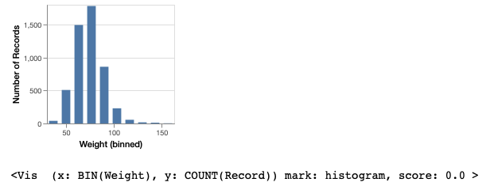
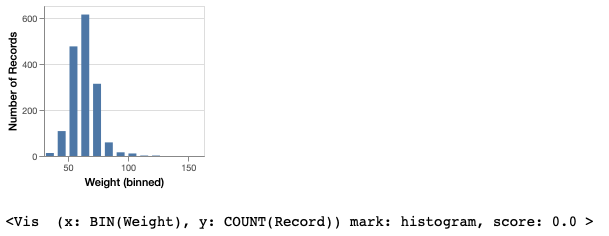
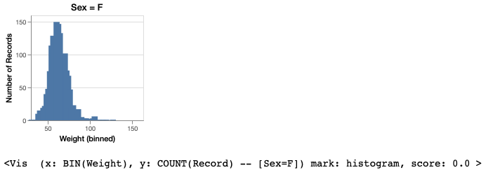
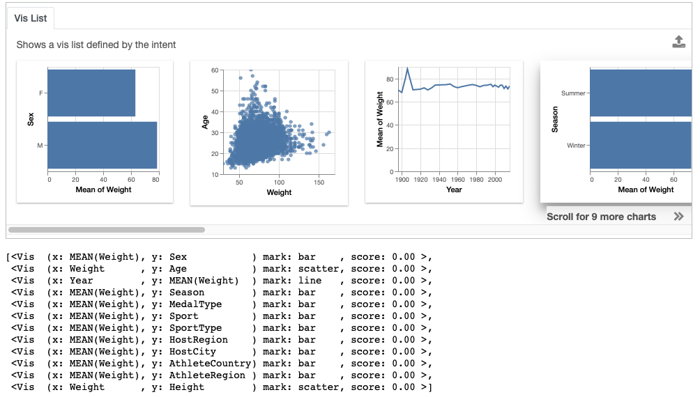
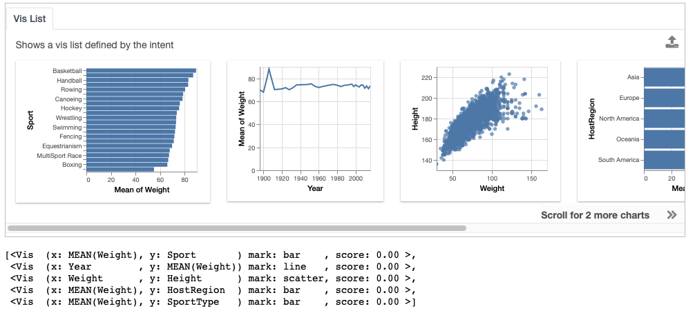
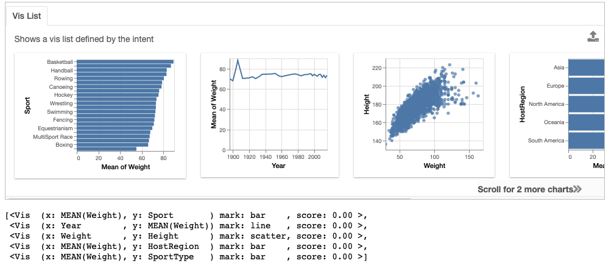

********************************
Constructing Vis and VisList
********************************

.. note:: You can follow along this tutorial in a Jupyter notebook. [`Github <https://github.com/lux-org/lux-binder/blob/master/tutorial/2-constructing-vis-and-vislist.ipynb>`_] [`Binder <https://mybinder.org/v2/gh/lux-org/lux-binder/master?urlpath=tree/tutorial/2-constructing-vis-and-vislist.ipynb>`_]

In the earlier tutorials, we have seen how Lux recommends visualizations automatically to the user. Often, the user might have a particular visualizations in mind that they want to specify. In this case, users can quickly define their own visualizations using Lux and visualize their data on-demand.
In this tutorial, we will introduce how to create a visualization via the Vis object and a collection of visualization via the `VisList` object.

Creating Desired Visualizations On-Demand using `Vis`
-----------------------------------------------------

A `Vis` object represents an individual visualization displayed in Lux, which can either be automatically generated or defined by the user.

To generate a `Vis`, users should specify their intent and a source dataframe as inputs. The intent is expressed using the same intent specification language described in the last tutorial. 

For example, here we indicate our intent for visualizing the `Weight` attribute on the dataframe `df`.

.. code-block:: python
	
	from lux.vis.Vis import Vis
	intent = ["Weight"]
	vis = Vis(intent,df)
	vis

We can very easily replace the Vis's source data without changing the `Vis` definition, which is useful for comparing differences across different datasets with the same schema. 

For example, we might be interested in the same `Weight` distribution, but plotted only on the subset of data with female athletes.

.. code-block:: python
	
	vis.refresh_source(df[df["Sex"]=='F'])
	vis

Likewise, we can modify the intent of the query, in this case, to increase the bin size of the histogram and to indicate the filtered source:

.. code-block:: python

	new_intent = [lux.Clause("Weight",bin_size=50),"Sex=F"]
	vis.set_intent(new_intent)
	vis

`Vis` objects are powerful programmatic representations of visualizations that can be exported into visualization code (more in the next tutorial) or be composed into a `VisList` collection.

Working with Collections of Visualization with `VisList`
--------------------------------------------------------

`VisList` objects represent collections of visualizations in Lux.

There are two ways to specify lists of visualization in Lux: 1) by specifying intent or 2) by manually composing `Vis` object into a list.

Approach #1: Specifying `VisList` using intent syntax
~~~~~~~~~~~~~~~~~~~~~~~~~~~~~~~~~~~~~~~~~~~~~~~~~~~~~

First, we look at an example of a `VisList` created through a user intent. Here, we create a vis collection of `Weight` with respect to all other attributes, using the wildcard "?" symbol.

.. code-block:: python

	from lux.vis.VisList import VisList
	vc = VisList(["Weight","?"],df)
	vc

Alternatively, we can specify desired attributes via a list with respect to `Weight`: 

.. code-block:: python

	vc = VisList(["Weight",['Sport','Year','Height','HostRegion','SportType']],df)
	vc

Approach #2: Specifying `VisList` by constructing `Vis` objects
~~~~~~~~~~~~~~~~~~~~~~~~~~~~~~~~~~~~~~~~~~~~~~~~~~~~~~~~~~~~~~~

`VisList` can be manually constructed by individually specifying the content of each `Vis`, then finally putting the entire list into a `VisList` object.

Here is the equivalent `VisList` example constructed using this approach:

.. code-block:: python

	from lux.vis.VisList import VisList

	vcLst = []
	for attribute in ['Sport','Year','Height','HostRegion','SportType']: 
	    vis = Vis([lux.Clause("Weight"), lux.Clause(attribute)])
	    vcLst.append(vis)
	vc = VisList(vcLst,df)

	vc

